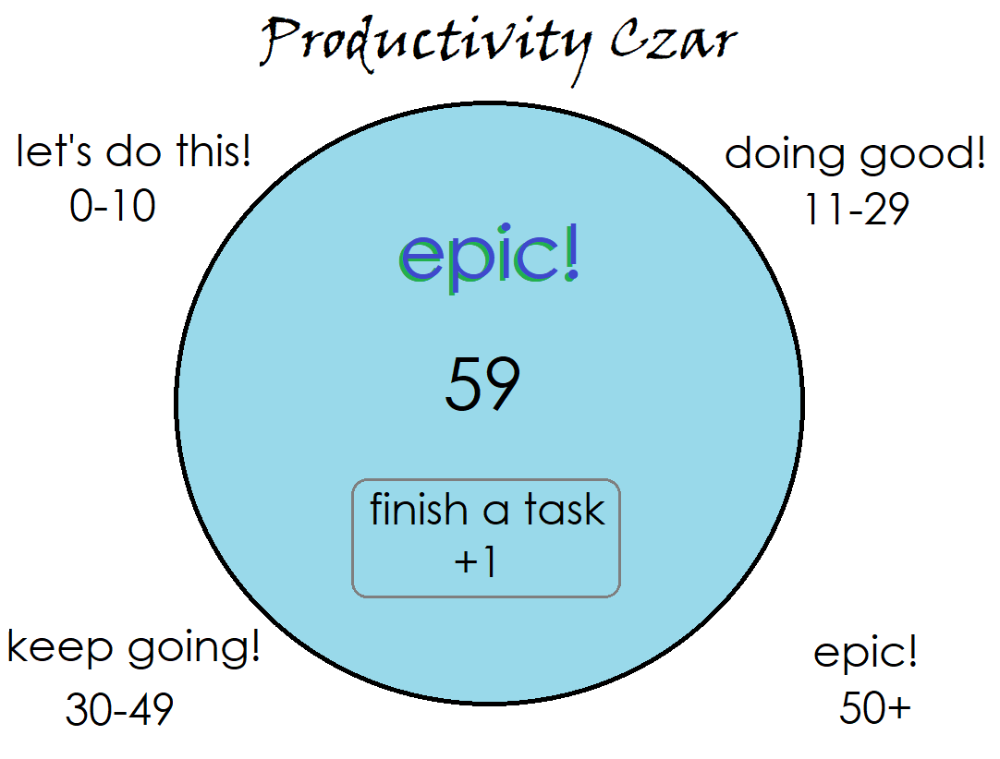

# Angular Extended Independent Project
by James Osborn

*--*

## Table of Contents
```
  i. Technical List  
  ii. Productivity Czar, .entropy wireframes  
  iii. 'Taking a break: a lesson from Metal Dog' -- a blog post
```

*--*

## Technical List
Every now and then it's good to pause and reflect on where you've come from and where you're going. Here are some areas I'd like to focus on improving in order to become a better developer:

### Design
My work at Epicodus has been largely focused on back-end languages. I often don't style my projects, because I'm focused on the functionality. I'd like to take some lessons on the design side to improve on my ability to style my projects.
* UI/UX Design
* Wireframes
* Photoshop
* Illustrator


### Databases
Being able to manage databases is going to be vital as a back-end developer, both for future employment and for any independent projects I decide to take on. It's important that I know the fundamentals of several different database languages, in order to become a developer with a diverse skillset.

* Firebase
* SQL


### Coding with New Languages
Now that I've learned the basics of a few different languages, I feel I'm ready to branch out and learn another language. Ruby and Python have interested me. I should compare and contrast the two further to decide which one I might want to learn next.

* Ruby
* Python
* C++

### Keeping Up With Known Languages

I want to keep reviewing and expanding on languages I've learned in the past, both to keep those skills sharp and up to date, and to learn the newest features.

* C# and Visual C
* MVC with C#
* .NET
* Asynchrony
* Exception Handling
* Parsing data from API calls

### Project Management

I really like working with small teams of developers. I'm good at finding out what their strengths are and then figuring out ways to help us all come together and accomplish great things. I want to expand on my experience as a project manager and search out employment opportunities in this department of the tech industry.

* Project Management
* Game Development & Unity

### Employment Preparation

I'm looking forward to taking some of the skills I've learned and putting them into practice in the field. In order to prepare myself for upcoming interviews, I'd like to focus on:

* Technical Terminology
* Whiteboarding Practice
* Practice Interview Questions
* Writing Cover Letters
* Resume Preparation
* Improving my LinkedIn profile  
* Blog posts
* Polishing past projects and READMEs
* Giving Presentations

### New Spoken languages
I've worked on some really diverse teams in the past, so I know how much diversity can add to a group's dynamics and success. I'd be very interested in international employment at some point in my career, if it were a possibility. And I'd like to increase my knowledge of the world at large by learning a new spoken language.

* Improving Spanish
* Learning Japanese

*--*

## Productivity Czar Wireframe
#### *An app that encourages you along a production cycle by incrementing a number every time you complete a task. Totally not vaporware.*

--


I spent a while thinking about what this app should do, how many buttons it should have, and rearranging these buttons and their names on the wireframe. Finally I decided it should be much more simple and straightforward.   

Growing up I always liked the Magic 8 Balls that would tell you your fortune. It seems like circles are not as prevalent in app design and everything is much more rectangular. I wanted to buck that trend with this idea in order to be a little new and different. For these reasons I picked the circular shape.

I used MS Paint for this wireframe, but I'm beginning to desire higher fidelity wire frames than what paint can produce. Sketch was recommended to me by a fellow student today, but it is not available for PCs. After I made this wireframe, I spent some time looking at Wireframe.cc as a free alternative for next week's group project.

After spending some time away from this and coming back, I had the idea for a few changes. There needed to be a clear button, and it seemed like their needed to be some additional functionality. Adding a countdown that could be incremented by an hour would be a good lesson.


Here is one other wireframe I made for my Intro group project. I generally enjoy the initial stage of planning out projects and throwing ideas around.  I find if everyone's voices and ideas are heard initially, and again throughout the development cycle, they are happier and more personally invested in the success of the project.

~


*-Storyboard from .entropy*

*--*

## Taking a break: a lesson from Metal Dog

2009 -- One random evening in my university years, I was playing an online video game called Call of Duty: Modern Warfare 2. It was a very popular game at the time with millions of players worldwide. Over the chat channel I heard someone say, "OMG, it's Metal Dog! Metal Dog is in our game!!! Metal Dog! Ahhhhh!"

"Who's Metal Dog?" someone else asked. Metal Dog, with a bunch of Xs and numbers interspersed in his gamertag, was the Number 1 player in CoD: MW2 on Xbox 360, the first person informed us. I checked the scoreboard and Metal Dog was at the top, carrying our team to victory. After the match ended, I checked the in-game global leaderboard to  verify that this person was indeed the number 1 player in the world, and they were. "Metal Dog, can you talk?? Give us some advice," one of them asked.

Then Metal Dog's mic snapped on, and he proceeded to give some of the best, most sagely advice that I've ever heard in my life:

#### *"When I'm playing the game and I start to get in a rut, start losing or dying a lot, I put down the controller and I take a break. I'll go make myself a sandwich, hang out with my girlfriend, go on a walk, whatever. I'll just do something else to break the rut."*

--  


It's been of my opinion and practice that the advice given to us from Metal Dog can be extrapolated out of gaming, and applied to web development, learning a new language, facing a particularly challenging task at work, or towards trying anything new in life. The lesson is simple: Take a break every once in awhile if things are getting tough. Walk around. Get in a different mind space for a moment, and consider a new approach.

And you know what? Turns out there is scientific data to back up Metal Dog's philosophy. A 2011 study done by the University of Illinois at Urbana-Champaign concluded that brief diversions from a task can dramatically improve one's ability to focus on that task for long periods of time.

https://www.sciencedaily.com/releases/2011/02/110208131529.htm

So next time you are facing down a particularly challenging dilemma, consider taking a break. It may very well be the solution to your problem.

*--*

## License
Copyright (c) 2017 James Osborn  
Please contact the developer if you find a way to monetize this product.  
This README.md uses the MIT license.
